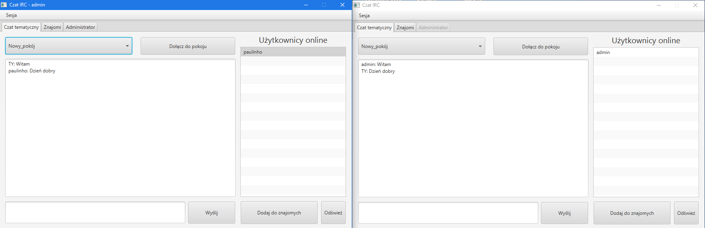
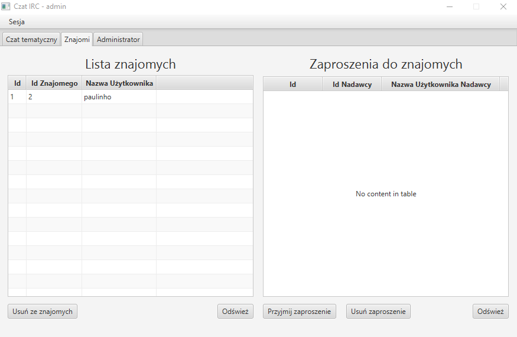
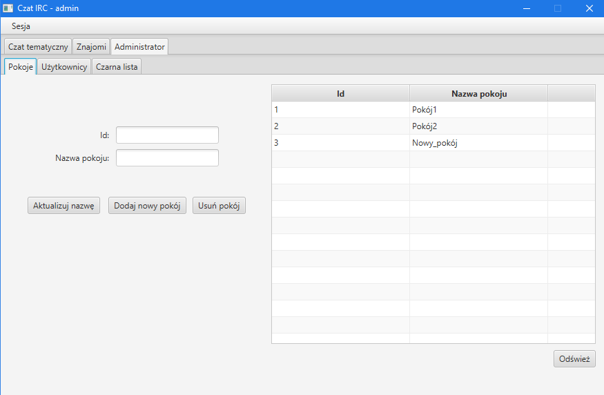
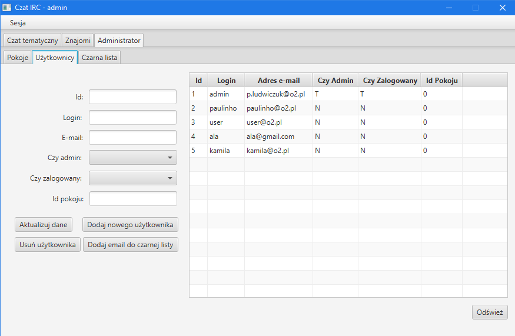

# CzatIRC

Czat tematyczny, w którym użytkownicy po wybraniu pokoju, mogą ze sobą rozmawiać. Stworzony został na zaliczenie jednego z przedmiotów na 1 roku studiów informatycznych II stopnia.

System składa się z dwóch programów: program klienta i program serwera.

Klient posiada interfejs graficzny GUI (JavaFX). Łączy się on z serwerem w celu wymiany informacji (wysyłania wiadomości do serwera i odbiór wiadomości innych użytkowników z serwera).

Serwer obsługuje wymianę wiadomości we wszystkich pokojach tematycznych (odbiera wiadomośc od klienta i wysyła ją do wszystkich innych zalogowanych do danego pokoju).

## Użytkownicy ##

Istnieją dwa rodzaje użytkowników: administrator i użytkownik zalogowany.
Administrator zarządza pokojami tematycznymi (dodawanie, usuwanie, zmiana nazwy), użytkownikami (dodawanie, usuwanie, wpisanie na czarną listę).
Zwykły użytkownik może zalogować sie do systemu, wybrać pokój tematyczny i uczestniczyć w rozmowie. Użytkownik może również zaprosić innego użytkownika z pokoju do znajmoych (zaproszony użytkownik może takie zaproszenie przyjąć, bądź odrzucić).

## Uruchamianie ##

Przed uruchomieniem aplikacji klienckiej, należy uruchomić serwer. Serwer korzysta z bazy danych SQLite, zamieszczonej w repozytorium. W bazie istnieje już konto admina o następujących danych:
- login: `admin`
- hasło: `admin`

Na początku działania programu, należy wskazać adres serwera (np. localhost).

## Przykładowy wygląd aplikacji klienckiej: ##

